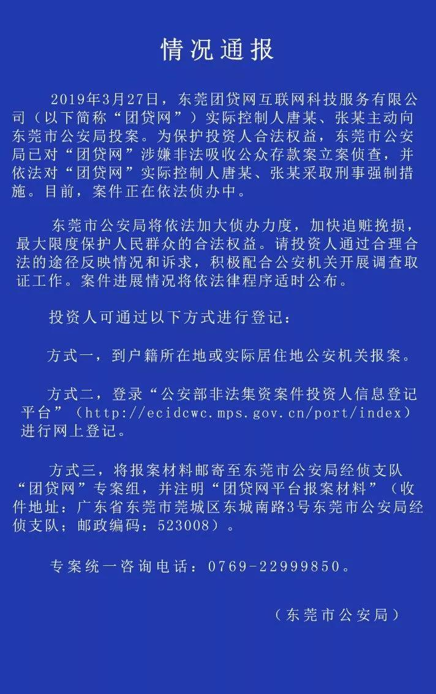
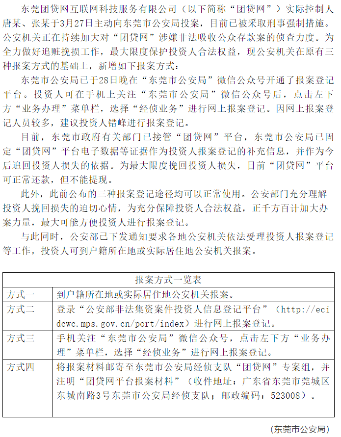
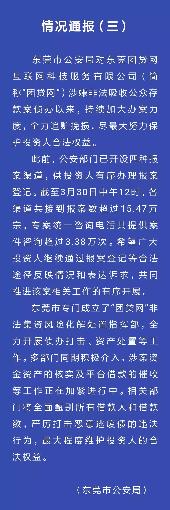
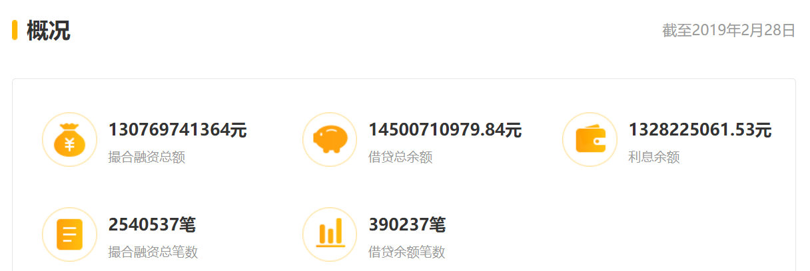
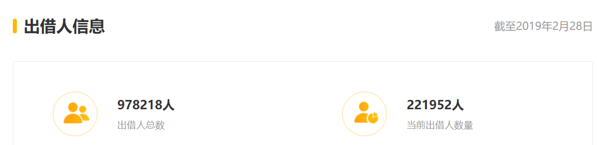
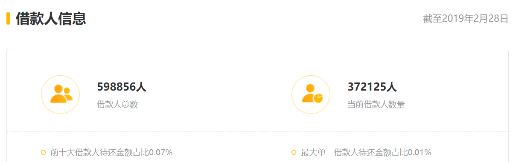

团贷消息汇总发布
===
3月28日，广东省东莞市公安局官方微博“平安东莞”发布通告显示，3月27日，东莞团贷网互联网科技服务有限公司（简称：团贷网）实际控制人唐某、张某主动向东莞市公安局投案。为保护投资人合法权益，东莞市公安局已对“团贷网”实际控制人唐某、张某采取刑事强制措施，目前案件正在依法侦办中。

办事原则
---

创建目的
---
全面收集各渠道的真实有效消息，帮助各出借人合法合理的维护自己的权益，尽最大努力挽回损失。

你可以做什么
---
1. 更新这个消息帖子，同时注明来源
2. 在中华人民共和国法律框架内，贡献出有效合理的维权办法

你不要做什么
---
1. 不要超出法律许可，做出损害国家人民的事
2. 不要散播未经证实的消息和谣言
3. 不要暴力，不要冲动
4. 任何时候都不要放弃希望，也不要沉溺在暴雷的阴影中，未来很长，也很短，铭记教训，创造未来。

初步方向-->
---
1. 要求政府明确成立团贷网事件专案组，加大办案力度，全力追赃挽损，定期披露案件进展；
2. 认真耐心听取受害者的合理诉求，不得隐瞒和压制；
3. 积极深入侦办案件，加紧催收借款，严厉打击其中各类违法腐败行为和人员，最大程度维护出借人的合法权益；
4. 待补充。。。

当下必做清单
---
1. 报案：
- 方式一：到户籍所在地或实际居住地公安机关报案。
- 方式二：登录“公安部非法集资案件投资人信息登记平台”（http://ecidcwc.mps.gov.cn/port/index）进行网上报案登记。
- 方式三：手机关注“东莞市公安局”微信公众号，点击左下方“业务办理”菜单栏，选择“经侦业务”进行网上报案登记。
- 方式四：将报案材料邮寄至东莞市公安局经侦支队“团贷网”专案组，并注明“团贷网平台报案材料”（收件地址：广东省东莞市莞城区东城南路3号东莞市公安局经侦支队；邮政编码：523008）。
2. 

东莞公安局官方消息
---
- 3.28 号

- 3.29 号

- 3.30 号

团贷网基本信息
---

消息出处
---
1. 微信公众号 “东莞市公安局”
2. 
