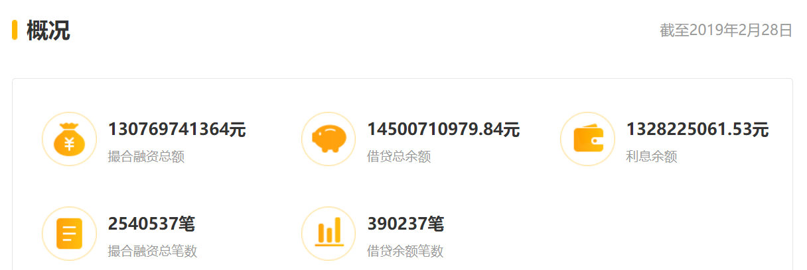
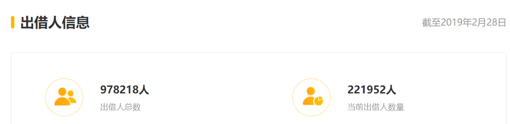
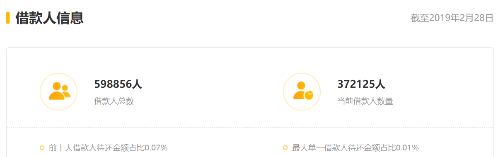

团贷受害（出借）人救赎之路
===

事件背景
---
3月28日，广东省东莞市公安局官方微博“平安东莞”发布通告显示，3月27日，东莞团贷网互联网科技服务有限公司（简称：团贷网）实际控制人唐某、张某主动向东莞市公安局投案。为保护投资人合法权益，东莞市公安局已对“团贷网”实际控制人唐某、张某采取刑事强制措施，目前案件正在依法侦办中。

办事原则
---

创建目的
---
收集各渠道的真实有效消息，不断寻找解决问题的最佳途径，帮助出借人合理合法的维护自己的权益，尽最大努力挽回损失。

使用说明
---
1. wiki 页面列出了每日动态和作业：https://github.com/tuandaimsg/tuandai-msg-release/wiki
2. 出借人债委会的最新消息，请访问 github：https://github.com/tdweiquan/tdw/wiki
3. 国产浏览器可能会屏蔽此站点，如有发生，请使用 Chrome、火狐、Safari等浏览器访问，或者用手机APP内置 Webview 访问

每日更新&作业
---
[请移步 Wiki 页面 https://github.com/tuandaimsg/tuandai-msg-release/wiki](https://github.com/tuandaimsg/tuandai-msg-release/wiki)

希望你做什么
---
1. 在中华人民共和国法律框架内，贡献出合法有效的维权办法
2. 贡献相关材料、想法和消息，可通过issue、pr 和 邮件等方式
3. 团结一心，永不放弃

你不要做什么
---
1. 不要超出法律许可，做出损害国家人民的事
2. 不要散播未经证实的消息和谣言
3. 不要暴力，不要冲动
4. 任何时候都不要放弃希望，也不要沉溺在暴雷的阴影中，未来很长，也很短，铭记教训，活在当下，面对明天

出借人使用团贷网的相关背书材料
---
1. 社会资质和荣誉，见文件夹 social-evaluation
2. 政府关怀历史，见文件夹 政府关怀记录
3. 维权的法律依据，见文件夹 法律依据
4. 审计材料，见文件夹 资质背书文件

消息材料出处
---
1. 微信公众号 “东莞市公安局”
2. 团贷网官网
3. 各出借人贡献

团贷网基本信息
---

